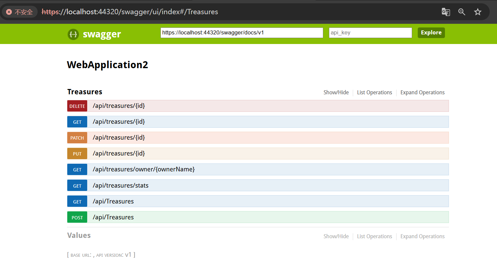
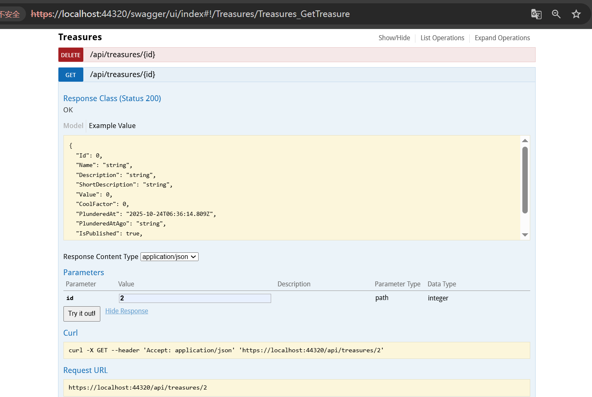
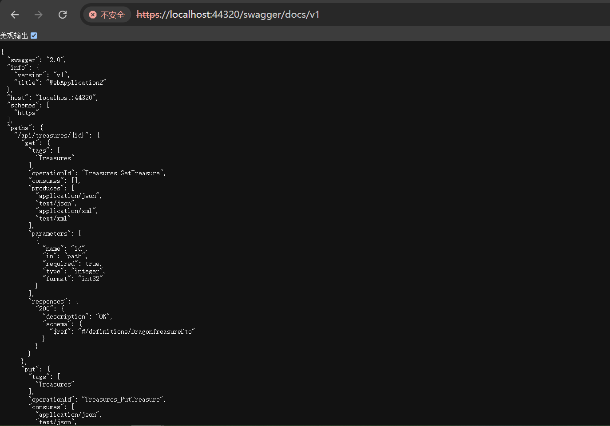
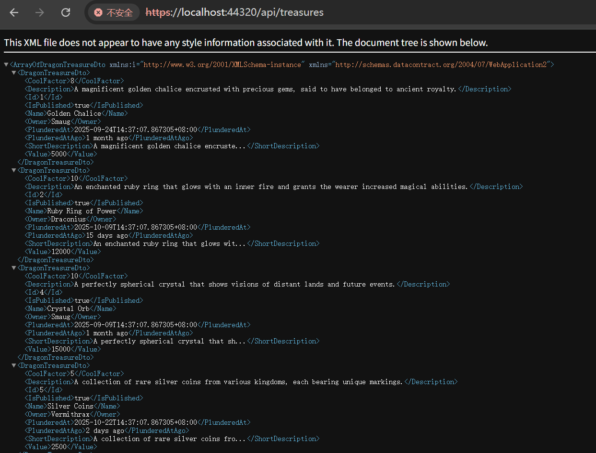
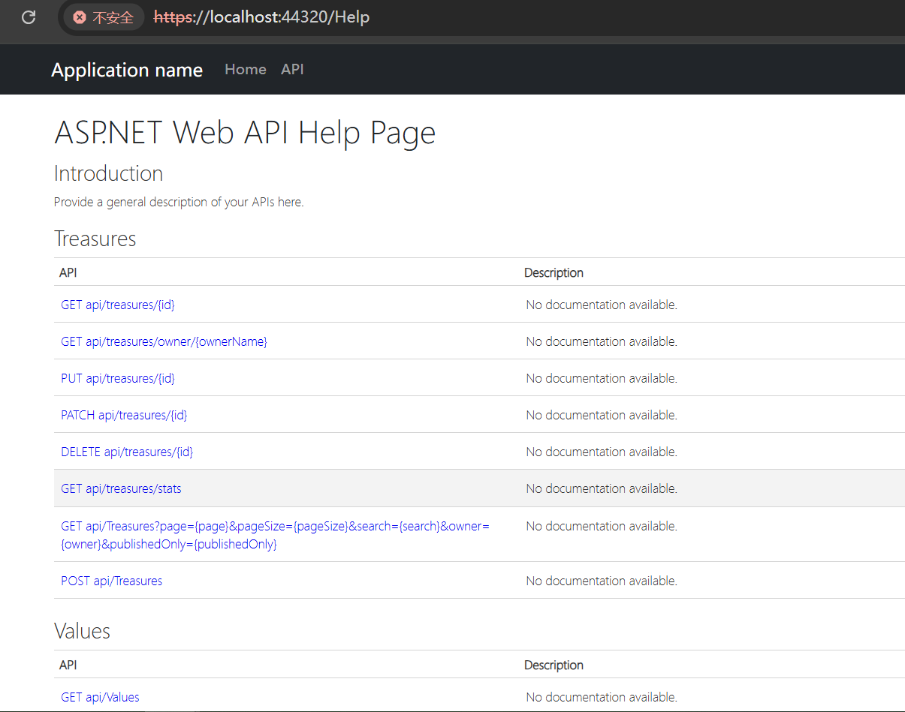

# Dragon Treasures Web API

This project implements a Dragon Treasures API resource, built using ASP.NET Web API 2 with VB.NET.

## Features

- **Complete REST API** for managing dragon treasures
- **Comprehensive validation** with data annotations
- **Search and filtering** capabilities
- **Pagination support**
- **Web API Help Page** documentation
- **Sample data** with various dragon treasures

## API Endpoints

### Base URL: `/api/treasures`

| Method | Endpoint | Description |
|--------|----------|-------------|
| GET | `/api/treasures` | Get all treasures with pagination and filters |
| GET | `/api/treasures/{id}` | Get a specific treasure by ID |
| GET | `/api/treasures/owner/{ownerName}` | Get treasures by owner name |
| GET | `/api/treasures/stats` | Get treasure collection statistics |
| POST | `/api/treasures` | Create a new treasure |
| PUT | `/api/treasures/{id}` | Update an existing treasure |
| PATCH | `/api/treasures/{id}` | Partially update a treasure |
| DELETE | `/api/treasures/{id}` | Delete a treasure |

### Swagger UI Interface





###Default API docs



## Query Parameters

### GET `/api/treasures`
- `page` (int): Page number (default: 1)
- `pageSize` (int): Items per page (default: 10, max: 50)
- `search` (string): Search in name and description
- `owner` (string): Filter by owner username
- `publishedOnly` (bool): Show only published treasures (default: true)

## Data Model

### DragonTreasure Properties

| Property | Type | Description | Validation |
|----------|------|-------------|------------|
| `Id` | int | Unique identifier | Auto-generated |
| `Name` | string | Treasure name | Required, 2-50 characters |
| `Description` | string | Detailed description | Required |
| `ShortDescription` | string | Truncated description (read-only) | Max 40 characters |
| `Value` | int | Value in gold coins | >= 0 |
| `CoolFactor` | int | Coolness rating | 0-10 |
| `PlunderedAt` | DateTime | When the treasure was plundered | Auto-set |
| `PlunderedAtAgo` | string | Human-readable time ago (read-only) | Calculated |
| `IsPublished` | bool | Whether treasure is public | Default: false |
| `Owner` | string | Dragon owner name | Required, max 100 chars |

## Sample Data

The API comes with pre-populated sample treasures:

1. **Golden Chalice** (Smaug) - 5,000 gold coins, Cool Factor: 8
2. **Ruby Ring of Power** (Draconius) - 12,000 gold coins, Cool Factor: 10
3. **Ancient Sword** (Pyrothia) - 8,500 gold coins, Cool Factor: 9
4. **Crystal Orb** (Smaug) - 15,000 gold coins, Cool Factor: 10
5. **Silver Coins** (Vermithrax) - 2,500 gold coins, Cool Factor: 5

## Usage Examples

### Get All Treasures
```http
GET /api/treasures?page=1&pageSize=10&publishedOnly=true
```

### Search Treasures
```http
GET /api/treasures?search=golden&owner=smaug
```

### Create New Treasure
```http
POST /api/treasures
Content-Type: application/json

{
  "Name": "Emerald Crown",
  "Description": "A crown made of pure emerald with magical properties",
  "Value": 25000,
  "CoolFactor": 9,
  "IsPublished": true,
  "Owner": "Smaug"
}
```

### Update Treasure
```http
PUT /api/treasures/1
Content-Type: application/json

{
  "Name": "Updated Golden Chalice",
  "Description": "An even more magnificent golden chalice",
  "Value": 6000,
  "CoolFactor": 9,
  "IsPublished": true,
  "Owner": "Smaug"
}
```

## Testing

### Interactive Test Page
Visit `/swagger` for an interactive test page that allows you to:
- View all treasures
- Search and filter treasures
- Create new treasures
- View API statistics
- Test all endpoints with a user-friendly interface

### Web API Help Page
Visit `/Help` to see the automatically generated API documentation with:
- Detailed endpoint descriptions
- Request/response examples
- Parameter documentation
- Sample JSON payloads

## Architecture

### Files Structure
```
WebApplication2/
Controllers/
TreasuresController.vb    # Main API controller
Models/
DragonTreasure.vb # Main data model
DragonTreasureDto.vb     # Data transfer object
Services/
DragonTreasureRepository.vb # Data access layer
```

### Key Features Implemented

1. **RESTful Design**: Follows REST conventions for resource management
2. **Data Validation**: Comprehensive validation using Data Annotations
3. **Error Handling**: Proper HTTP status codes and error responses
4. **Documentation**: XML documentation comments for Help Page
5. **Filtering & Search**: Multiple ways to query the data
6. **Pagination**: Built-in pagination support
7. **Sample Data**: Rich sample dataset for testing

## Running the Project

1. Build and run the project in Visual Studio
2. Navigate to `/Help` to see API documentation
3. Use `/swagger` for interactive testing
4. Test endpoints using tools like Postman or curl
5. View source code to understand the implementation

## Future Enhancements

Potential improvements that could be added:

- Database integration (Entity Framework)
- Authentication and authorization
- Caching support
- Rate limiting
- API versioning
- Swagger/OpenAPI documentation
- Unit and integration tests
- Logging and monitoring
